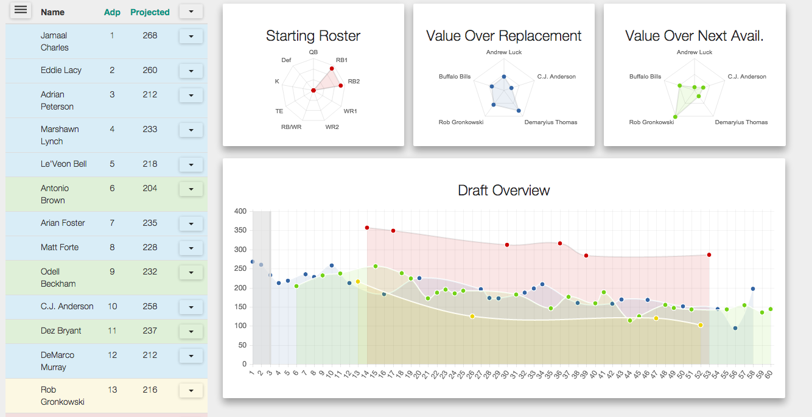

## Fantasy Football Draft Insights Dashboard
[](https://heroku.com/deploy)

###Features
* All draftworthy players with projections and adps
* Ability to favorite, sort, and draft players
* Chart for starting roster
* Chart for value over replacement for available players
* Chart for value over next available for available players
* Overview chart that status of the draft and projects future picks



###Installation
```
npm install
npm start
```

###Not yet implemented
* Keeping track of all teams not just yours
* Ability to look forward to see which players will likely be available at your later picks
* Player news
* Adjustable projections
* More visualizations!

##Disclaimer
The Data in the data folder is not created by me and does not belong to me.  It is freely available on Fantasy Sharks and Fantasy Pros
